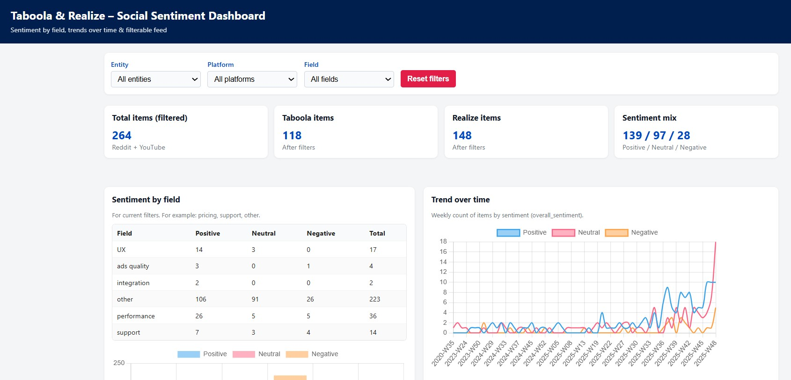
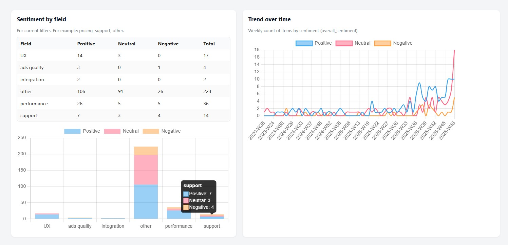

# 🎧 Social Listening Agent  
### Monitoring Public Sentiment for **Taboola** & **Realize**

This repository contains two lightweight pipelines that collect public mentions of **Taboola** and **Realize** from Reddit combined with either **Hacker News** or **YouTube**, analyze sentiment using OpenAI model, and generate structured insights including an HTML dashboard.

---

## 📁 Project Structure

```
.
├── agent_reddit_hacker/
│   ├── run_reddit_hacker.py
│   ├── dashboard_template.html
│   ├── dashboard.html
│   ├── all_results.json
│   └── aggregates.json
│
├── agent_reddit_youtube/
│   ├── run_reddit_youtube.py
│   ├── dashboard.html
│   ├── results.json
│   └── test_reddit_hacker.py
│
└── dashboard_screenshots/
    ├── reddit_hacker_dashboard/
    │   ├── part1.jpg
    │   ├── part2.jpg
    │   └── part3.jpg
    │
    └── reddit_youtube_dashboard/
        ├── part1.jpg
        ├── part2.jpg
        └── part3.jpg

```

> JSON + HTML files are generated automatically when running each pipeline.

---

## 🧩 Cloning & Running the Project

### 1. Clone the repository

```bash
git clone https://github.com/ShunitTruzman/social-listening-agent.git
cd social-listening-agent
```

✔ Important: You **must be inside the project folder** to run the scripts.

---

## ⚙️ Setup

### 1. Create a virtual environment

```bash
python -m venv .venv
source .venv/bin/activate      # macOS / Linux
# .\.venv\Scripts\Activate.ps1  # Windows PowerShell
```

### 2. Install dependencies

```bash
pip install -r requirements.txt
```

---

## 🔑 Environment Variables

### macOS / Linux

```bash
export OPENAI_API_KEY="your_openai_key"
export OPENAI_MODEL="gpt-4o-mini"
export YOUTUBE_API_KEY="your_youtube_key"  # only for YouTube pipeline
```

### Windows (CMD Terminal)

```cmd
set OPENAI_API_KEY=your_openai_key
set OPENAI_MODEL=gpt-4o-mini
set YOUTUBE_API_KEY=your_youtube_key    # only for YouTube pipeline
```

The scripts read them using `os.getenv()`.

---

## ▶️ Running the Pipelines

### 1️⃣ Reddit + Hacker News

```bash
cd agent_reddit_hacker
python run_reddit_hacker.py
```

This pipeline will:

- Fetch most recent Reddit + Hacker News mentions  
- Deduplicate records  
- Run LLM sentiment analysis:
  - product, performance, business, brand  
- Extract themes + representative quotes  
- Build weekly trend  
- Generate a full HTML dashboard  
- Test the pipeline

**Outputs:**

| File | Description |
|------|-------------|
| `all_results.json` | All raw items enriched with LLM analysis |
| `aggregates.json` | Sentiment per field, themes, weekly trend |
| `dashboard.html` | Interactive visualization using the template |

---

### 2️⃣ Reddit + YouTube

```bash
cd agent_reddit_youtube
python run_reddit_youtube.py
```

This pipeline will:

- Fetch most recent Reddit posts + comments  
- Fetch most recent YouTube comments for matching videos  
- Run batched LLM analysis:
  - entities, overall sentiment  
  - structured fields  
  - topic extraction  
  - summary text  
- Compute weekly sentiment trend  
- Generate a lightweight HTML dashboard

**Outputs:**

| File | Description |
|------|-------------|
| `results.json` | Items + sentiment distribution + trend + top themes |
| `dashboard.html` | Lightweight browser-based insights page |

Run the optional test:

```bash
python test_reddit_hacker.py
```

---


## 🖼️ Dashboard Previews — Reddit + YouTube

<div align="center">
  <br><br>
  <br><br>
  
</div>
